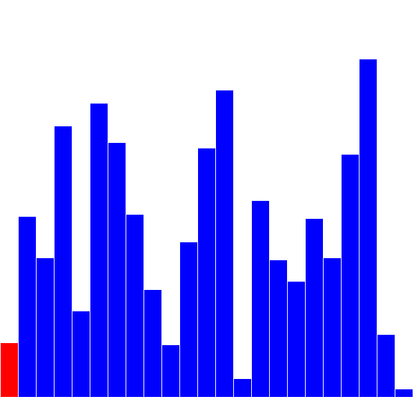

# 20 - Selection Sort

###### ICS4U - Mr. Brash 🐿️

This is another extremely common sorting method. This algorithm traverses the array and finds the smallest item. It then _swaps_ the smallest with the first item. Once an item has been swapped, the length of the search window is decreased by 1 and that item is never considered again.

<table>
<tr>
    <td><a href="https://commons.wikimedia.org/wiki/File:%D0%A1%D0%BE%D1%80%D1%82%D0%B8%D1%80%D0%B0%D1%9A%D0%B5_%D1%81%D0%B5%D0%BB%D0%B5%D0%BA%D1%86%D0%B8%D1%98%D0%BE%D0%BC.gif"></a>
</td>
<td>
    
</td>
</tr>
</table>


This algorithm _greatly reduces the number of swaps_ but still requires **many** comparisons.

### Alternate Version:

In a different version we find the _largest_ item and swap it to the _end_ of the array. Functionally there is no difference.

In the "Find the Largest" version, on each pass of the algorithm:
- Find the index of the largest value in the search window
- Swap that item with the item at the _end_ of the search window
- Reduce the search window length by 1
- Repeat

### Code:

1. Write the function `selection_sort(unsortedArray, debug = false)`. This function will sort the contents in a _copy_ of `unsortedArray` using [the alternate Selection Sort given above](#alternate-version).  
  
    To clarify:  Your implementation will move **_large_ items to the _end_ of the list**.
  
    It will _return_ the sorted array. The `debug` flag, if `true`, causes the function to print the array to the console after each _swap_. Feel free to copy and paste useful code from previous projects for this.  

2. Write the function `topX(x, data)` which returns an array of the top (largest) `x` items in the array **`data`**. It will utilize a _partial_ selection sort, **only sorting the top `x` elements** and return that sorted array of size `x`. The returned array should be sorted in _ascending_ order. **Pay close attention to the mention of _partial sort_** - you should _not_ sort the entire array, that's a waste of time.
 
3. Write the function `bottomX(x, data)`. Similar to `topX`, it will use a _partial_ selection sort and return the bottom (lowest) `x` many values from the array **`data`** in _ascending_ order. Again, you should _not_ sort the entire array.
  
4. (optional) Write the function `rank(value, data)` that returns the numeric rank (position) of the first instance of `value` in the _unsorted_ array `data`. Return -1 if the value is not found. **For example:**<br>
    ```JS
    > rank(13, [19,3,0,52,13,4,9,2,0,1])
    8
    
    > rank(4, [19,3,0,52,13,4,9,2,0,1])
    6
    
    > rank(8, [19,3,0,52,13,4,9,2,0,1])
    -1

    > rank(0, [19,3,0,52,13,4,9,2,0,1])
    1
    ```

    **Note** - As with the previous sorting tasks, you are permitted to write your own helper functions, utilize the functions in the [`Library`](library.js), or copy useful code you wrote for previous projects.

### Discussion Questions:

Answer the following discussion questions in the [index.html](index.html) file.

1. What would you have to change in your code of `selection_sort()` to have it sort in _descending_ order? Include the line-number(s) from your `script.js` file when discussing your answer.
2. What would you have to change in your code for `selection_sort()` to have it swap the lowest value to the front of the array instead of the largest to the end? Include the line-number(s) from your `script.js` file in your answer.
3. Is Selection Sort “stable”? Explain your reasoning.

Note - [the HTML file](index.html) has not been set up for your answers. You will need to do this.

<br><br>

🐿️
